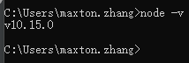
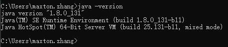
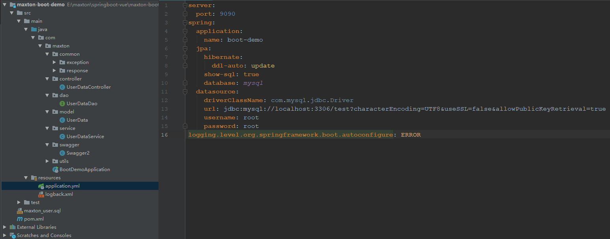
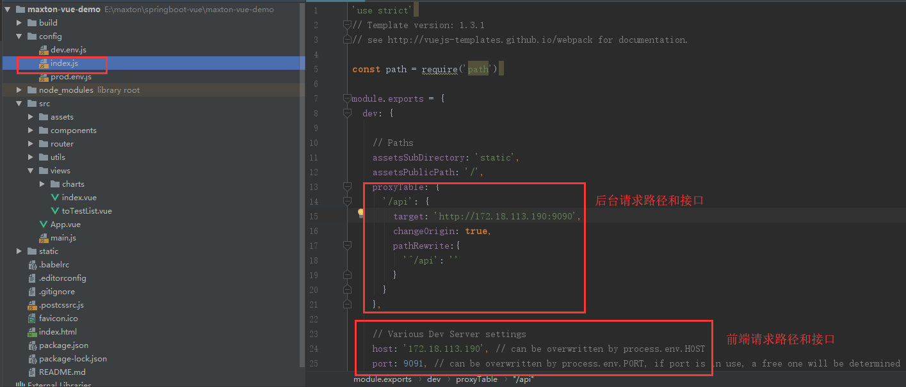
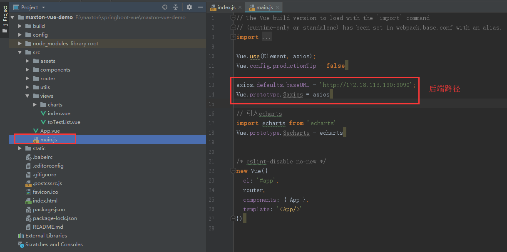
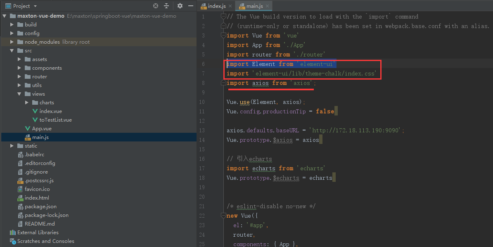
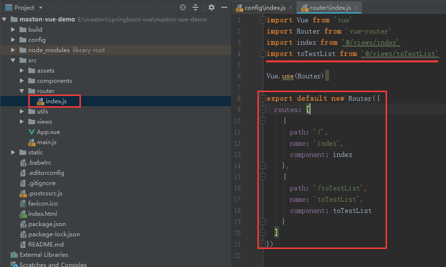

环境准备

后端:JDK1.8,数据库8.0+,maven

前端:node10.15+

查看环境方式

打开CMD窗口






创建数据库

```
SET NAMES utf8mb4;
SET FOREIGN_KEY_CHECKS = 0;
-- ----------------------------
-- Table structure for maxton_user
-- ----------------------------
DROP TABLE IF EXISTS `maxton_user`;
CREATE TABLE `maxton_user`  (
  `user_id` varchar(40) CHARACTER SET utf8 COLLATE utf8_general_ci NOT NULL,
  `address` varchar(255) CHARACTER SET utf8 COLLATE utf8_general_ci NULL DEFAULT NULL,
  `age` int(11) NULL DEFAULT NULL,
  `birthday` datetime(0) NULL DEFAULT NULL,
  `create_time` datetime(0) NULL DEFAULT NULL,
  `credits` float NULL DEFAULT NULL,
  `height` double NULL DEFAULT NULL,
  `name` varchar(255) CHARACTER SET utf8 COLLATE utf8_general_ci NULL DEFAULT NULL,
  `sex` int(11) NULL DEFAULT NULL,
  PRIMARY KEY (`user_id`) USING BTREE
) ENGINE = InnoDB CHARACTER SET = utf8 COLLATE = utf8_general_ci ROW_FORMAT = Dynamic;
SET FOREIGN_KEY_CHECKS = 1;
```

文件中会有可执行的sql语句并且有部分模拟数据

后端环境搭建

使用idea创建一个springboot项目

创建过程可参照springboot创建项目流程,过程省略



注:1.查看pom文件引用的包

2.修改resources下的配置文件中,数据库地址名称和账号密码等

3.本文采用的是springdataJPA,如需更改可修改为mybatis或mybatisplus等,这里不做解释

4.自行更改maven仓库地址

5.包含基本的工具类统一异常处理和统一返回值处理

6.下载后创建数据库运行可直接测试查看swagger: http://localhost:9090/swagger-ui.html

7.后端使用jpa实现了增删改查及条件查询分页等

源码参考GitHub地址: https://github.com/daweizi310/springboot-vue-demo.git

前端环境搭建

这里采用的初始化一个vue项目,没有使用成熟框架,效果大差不差

初始化参考网址: https://segmentfault.com/a/1190000013950461

源码参考GitHub地址: https://github.com/daweizi310/springboot-vue-demo.git

注:1.项目初始化时的问题自己可参考网址注意

2.前后端分离需要注意跨域配置



3.ajax路径配置



4.elementUI引入参考网址: https://element.eleme.io/#/zh-CN/component/installation



5.路由配置



